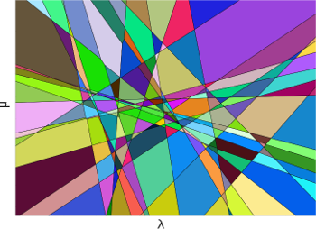

This is a MatLab/C++ code for finding the solution diagram of the two-parametric max-flow problem [1].

Solution diagram of a random 25 variable problem.

Problem description
--
Given two parameters \lambda and \mu and n binary variables x_i the objective function to be minimized is

E(x) = \sum\_i (a\_i+b\_i\lambda + c\_i\mu)*x\_i + \sum\_(i,j\in N) x\_i*(1-x\_j)*d\_ij

where a,b,c,d are problem specific parameters restricted to be integers. 
For fixed \mu and \lambda the optimal solution can be found efficiently via max-flow/min-cut.

Code
--
This code returns a solution diagram with the optimal solution given any choice of \lambda and \mu.

The algorithm works by intersecting tangent planes over and over again. 
This gives rise to numerical issues, to to tackle this the intersections are performed with exact arithmetic using the CGAL library [2].

Each max-flow problem is solved using [3].

The  tangent plane intersections in CGAL is rather slow making this code intractable for large problem.

Installation 
----------
The code uses Computational Geometry Algorithms Library (CGAL),
install instruction can be found at 
[http://doc.cgal.org/latest/Manual/installation.html](http://doc.cgal.org/latest/Manual/installation.html).

### Linux ###
For Debian based distributions there is a CGAL package: libcgal-dev.

### Windows ###
Follow the instructions and go into Parametric.m and change

* boost_root = 'C:\dev\boost_1_55_0'
* cgal_root = 'C:\dev\CGAL-4.4'

You also have to change the name of the libraries, they are named after the compiler you are using.
Current names are for Visual Studio 2013 (version 12).

#### Precompiled mex files ####
Check the release tab for precompiled mex files for Windows and Linux.

* Windows require Visual studio 2013 runtime libraries.

Usage
----------
See examples/example.m

References
----------

1. __Constructing the minimization diagram of a two-parameter problem__.  
Operations research letters, 1990  
_D. Fernández-Baca and S.Srinivasan_.

2. __CGAL: the computational geometry algorithms library__.  
Proceedings of the 17th ACM SIGSPATIAL international conference on advances in geographic information systems. ACM, 2009.  
_Fabri, Andreas, and Sylvain Pion_.

3. __An experimental comparison of min-cut/max-flow algorithms for energy minimization in vision__.  
Pattern Analysis and Machine Intelligence (PAMI) 2004.  
_Boykov, Yuri, and Vladimir Kolmogorov_.