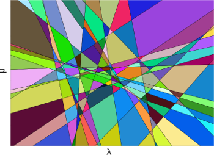
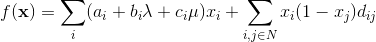

MATLAB/C++ code for finding the solution diagram of the two-parameter max-flow problem [1].

Solution diagram for a random 25 variable problem. Each region corresponds to a solution and is given a random color.

Problem description
--
Given a vector of binary variables `x`  and two continuous parameters `λ` and `μ` define the objective function

where `a`,`b`,`c`, and `d` are problem specific parameters restricted to be integers and `N` is some neighborhood, for instance the [4-neighborhood](https://en.wikipedia.org/wiki/Pixel_connectivity).

For any fixed values of λ and μ the optimal solution can be found efficiently via max-flow/min-cut.

The solution diagram gives the solution `x` minimizing `f` for *any* choice of λ and μ.

A more detailed descriptions is given in [4].

Code
--
The algorithm works by intersecting tangent planes over and over again.
This gives rise to numerical issues, to tackle this the intersections are performed with exact arithmetic using the CGAL library [2].

Each max-flow problem is solved using [3].

The  tangent plane intersections in CGAL is rather slow making this code intractable for large problem.

Installation
----------
The code uses Computational Geometry Algorithms Library (CGAL),
install instruction can be found at
[http://doc.cgal.org/latest/Manual/installation.html](http://doc.cgal.org/latest/Manual/installation.html).

### Linux ###
For Debian based distributions there is a CGAL package: libcgal-dev.

### Windows ###
Follow the instructions and go into `Parametric.m` and change

* boost_root = 'C:\dev\boost_1_55_0'
* cgal_root = 'C:\dev\CGAL-4.4'

You also have to change the name of the libraries, they are named after the compiler you are using.
Current names are for Visual Studio 2013 (version 12).

#### Precompiled mex files ####
Check the release tab for precompiled mex files for Windows and Linux.

* Windows require Visual studio 2013 runtime libraries.

Usage
----------
See [examples/example.m](examples/example.m).

References
----------

1. __Constructing the minimization diagram of a two-parameter problem__.  
Operations research letters, 1990  
_D. Fernández-Baca and S.Srinivasan_.

2. __CGAL: the computational geometry algorithms library__.  
17th ACM SIGSPATIAL international conference on advances in geographic information systems, 2009.  
_A. Fabri and P. Sylvain_.

3. __An experimental comparison of min-cut/max-flow algorithms for energy minimization in vision__.  
Pattern Analysis and Machine Intelligence (PAMI), 2004.  
_Y. Boykov and V. Kolmogorov_.

4. __Higher-Order Regularization in Computer Vision__.  
PhD Thesis, Lund University, 2014.  
_J. Ulèn_.
